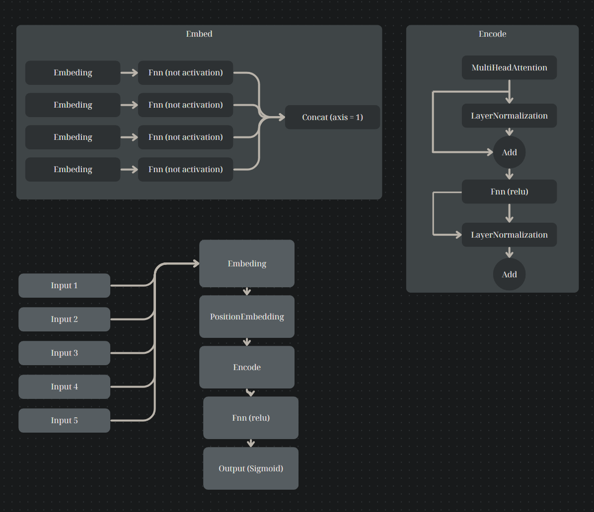
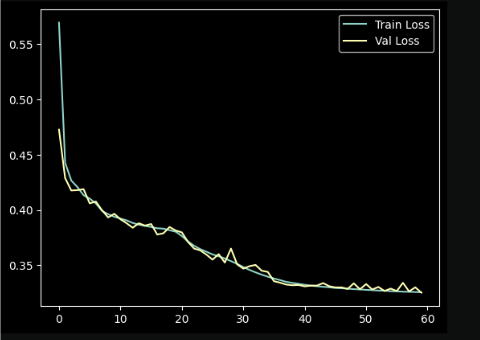
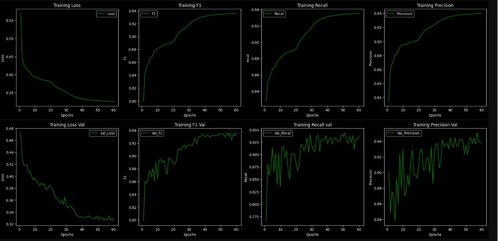

## XÂY DỰNG MÔ HÌNH NHẬN DIỆN TÉ NGÃ ĐỘT QUỴ VỚI YOLO V8 BẢNG CẢI TIẾNG

## Lời mở đầu 
- Trong bối cảnh dân số ngày càng già hóa và tỷ lệ mắc các bệnh liên quan đến đột quỵ ngày càng gia tăng, việc phát hiện kịp thời các sự cố té ngã trở thành một yêu cầu cấp thiết trong chăm sóc sức khỏe. Đột quỵ và té ngã là những nguy cơ lớn đối với người cao tuổi và những người có bệnh lý nền, có thể dẫn đến các biến chứng nghiêm trọng nếu không được can thiệp kịp thời.
- Dự án này hướng tới mục tiêu xây dựng một hệ thống nhận diện té ngã sử dụng mô hình YOLO V8 - một phiên bản cải tiến hiện đại trong lĩnh vực thị giác máy tính. Với khả năng nhận diện đối tượng nhanh chóng và chính xác, YOLO V8 không chỉ giúp phát hiện các tình huống nguy hiểm một cách hiệu quả mà còn hỗ trợ việc triển khai trên các thiết bị phần cứng hạn chế như camera giám sát hoặc các thiết bị IoT.
- Hệ thống được kỳ vọng sẽ mang lại giải pháp công nghệ tiên tiến, góp phần nâng cao chất lượng chăm sóc sức khỏe và cải thiện khả năng đáp ứng của các dịch vụ y tế trong việc bảo vệ tính mạng người dân.

## Thành viên thực hiện 
- Nguyễn Lê Quốc Bảo - tham gia đóng góp 80% (bản thân) (Cài đặt huấn luyện mô hình, code xử lý data, tìm kiếm nguồn data, code demo cho mô hình sau huấn luyện).
- Lê Văn Tuyến - tham gia đóng góp 10% (Tiến hành xử lý data)
- Phan Triệu Tỷ - tham gia đóng góp 10% (Viết báo cáo)

## Các vị trí trong dự án
- Ba (phân tích mô hình, tìm kiếm mô hình, tìm kiếm data, viết báo cáo).
- Dev (lập trình code xử lý data, cài đặt mô hình, huấn luyện và test mô hình).
- leader (Điều hành, bố trí các thành viên làm việc)

## Vị trí của bản thân
- Dev, Ba, leader

## Mô hình sử dụng và lĩnh vực 
- Yolo v8
- Lĩnh vực Object Detection

## Các thư viện và ngôn ngữ sử dụng trong dự án
- Ngôn ngữ Python
- Opencv
- Numpy
- Tensorflow
- Sklean
- Pandas

## Các công cụ hỗ trợ 
- Jupyter lab (trainning).
- IDE: vscode(tạo dữ liệu mẫu, xử lý dữ liệu, kiểm tra mô hình, xây dựng mô hình).

## Kiến trúc mô hình

## Loss sau 60 epochs

## Phân bố nhãn

## Phân bố dự đoán

## Ma trận dự đoán

## Các thông số khác

## Video demo cho dự án 
- (chưa cập nhật)
<!--  -->

## Tài liệu
- (chưa cập nhật)
<!-- - [Báo cáo chi tiết dự án](report/Đồ%20án%20nhóm.doc)
- [Báo cáo tóm tắt dự án](report/Tóm%20Tắt.docx) -->

## Link data và mô hình (file trọng số).
- [Data](https://drive.google.com/drive/folders/1loOymzPCEYAU3fz-B6TRfFGKKHBf9Va-?usp=sharing)
- [Trọng số mô hình (dùng tf để load)](https://drive.google.com/drive/folders/1hqKIXfcUNyF4ySWlBAMjTWI-jJBjSwgI?usp=sharing)

